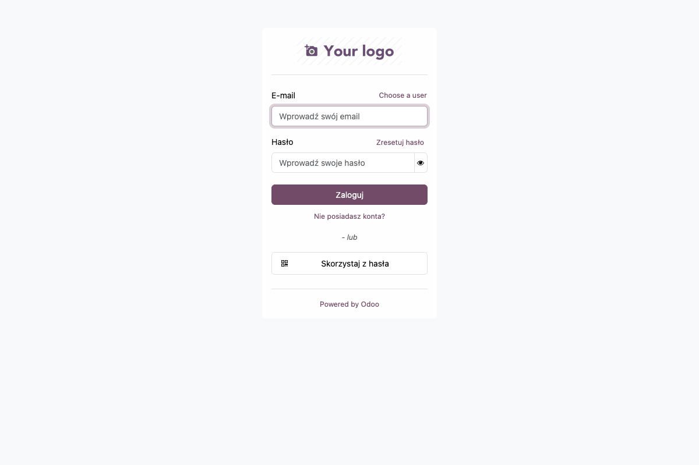
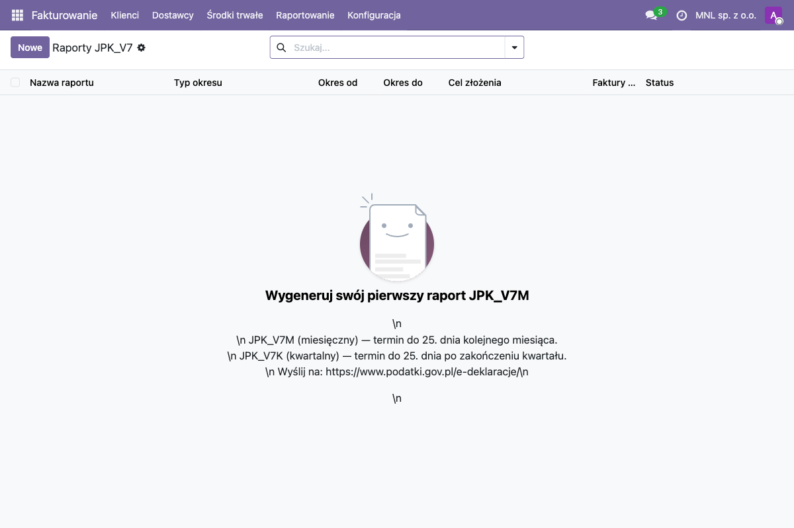
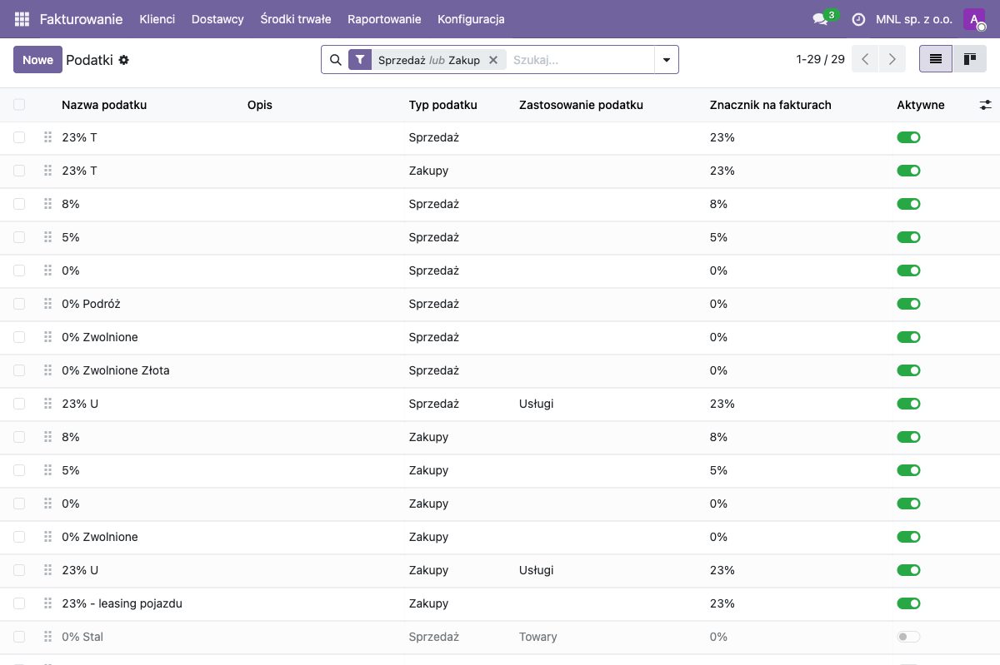
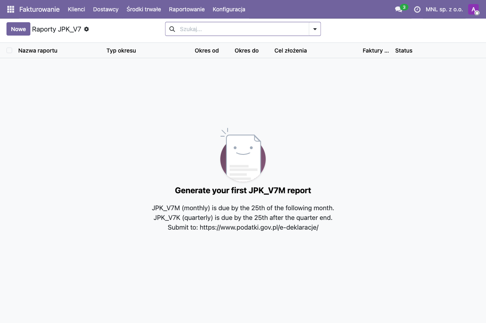
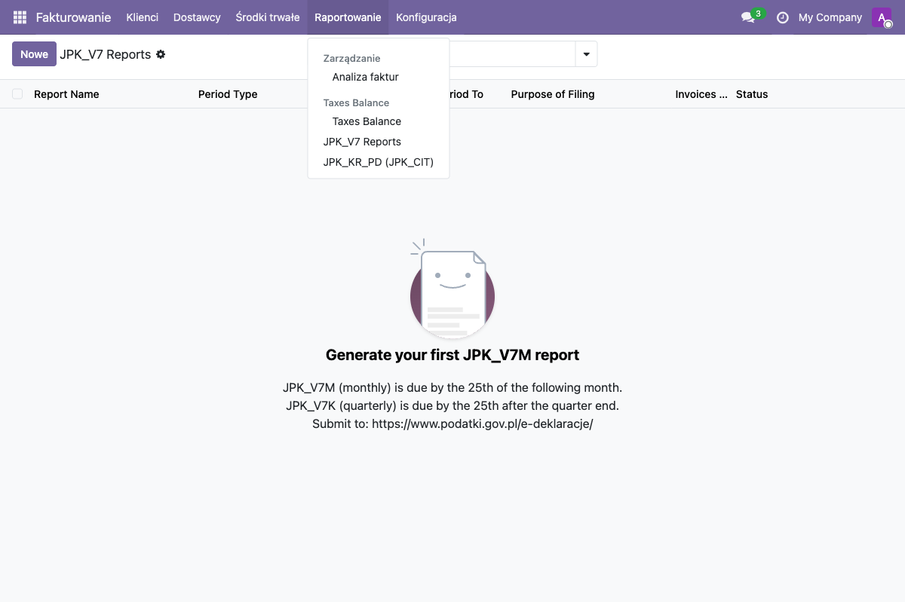
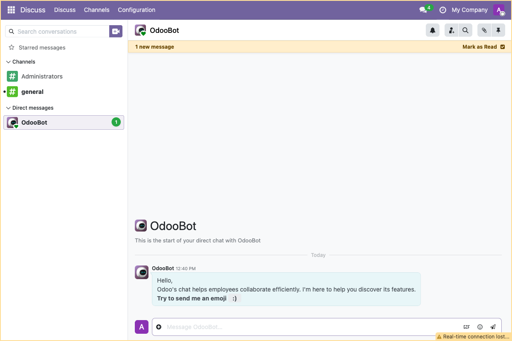

<div align="center">

# polodoo

**Darmowa, polska, w pełni zgodna księgowość dla sp. z o.o. na Odoo 19**

KSeF FA(3) · JPK_V7M(3) · JPK_KR_PD · Biała Lista · MPP · ZUS/PIT
100% open source · €0 licencji · Coolify-ready · AI-assisted

🇬🇧 [English version](./README.en.md)

[](./LICENSE)
[](https://github.com/odoo/odoo/tree/19.0)
[](https://api.ksef.mf.gov.pl/api/v2)
[-orange.svg)](https://www.podatki.gov.pl/podatki-firmowe/jednolity-plik-kontrolny/)

</div>

---

## Co to jest

**polodoo** to gotowy, samohostowany system księgowy dla polskich spółek z o.o.,
oparty na Odoo 19 Community Edition. Wszystko czego potrzebujesz do prowadzenia
**pełnej księgowości** zgodnie z polskim prawem (Ustawa o rachunkowości, KSeF,
JPK_V7M(3), JPK_CIT) — **bez płacenia za licencje**.

> **Model "prezes podpisuje sam":**
> Po deregulacji z 2014 r. (Dz.U. 2014 poz. 768) Prezes Zarządu może
> samodzielnie prowadzić księgi i podpisać sprawozdanie finansowe
> w podwójnej roli (Art. 4 ust. 5 + Art. 52 ust. 2 UoR). Audytor weryfikuje,
> ale **nie musi nic podpisywać**.



## Czemu warto

| | |
|---|---|
| 🇵🇱 **Polskie GUI** | Pełne polskie tłumaczenia w każdym module |
| ⚖️ **W pełni zgodne** | KSeF + JPK_V7M(3) + JPK_KR_PD + biała lista + MPP |
| 💰 **€0 licencji** | Tylko Odoo CE + OCA + nasze moduły (wszystko LGPL/AGPL) |
| 🤖 **AI-friendly** | Zaprojektowane do współpracy z Claude / ChatGPT |
| 🐳 **Coolify-ready** | Docker Compose + Traefik + Let's Encrypt out-of-the-box |
| 🔒 **Bezpieczne** | XXE-hardened, brute-force rate-limit, HSTS, security headers |

## Co dostajesz

### Moduły własne (LGPL-3, w tym repo)

- **`l10n_pl_edi_fixes`** — łata KSeF FA(3): GTU codes, MPP (P_18A), zwolnienia VAT (P_19A)
- **`l10n_pl_jpk_v7`** — generator JPK_V7M(3) / JPK_V7K(3) zgodny ze schematem MF z 2025-12-19
- **`l10n_pl_jpk_kr_pd`** — generator JPK_KR_PD (JPK_CIT), termin 31 lipca 2027
- **`l10n_pl_nbp_rates`** — codzienne kursy NBP Tabela A

### Moduły wbudowane Odoo 19 CE

- `l10n_pl` — polski plan kont, stawki VAT, kody GTU
- `l10n_pl_edi` — KSeF FA(3) API v2.6.0
- `l10n_pl_bank_verification` — **biała lista** automatycznie przy płatnościach > 15 000 zł
- `l10n_pl_taxable_supply_date` — data dostawy (P_6)

### Submoduły OCA (AGPL-3, instalowane jednym skryptem)

- `account_asset_management` — środki trwałe i amortyzacja
- `account_financial_report` — Zestawienie Obrotów i Sald, Dziennik, rozrachunki
- `report_xlsx` — eksport Excel
- `l10n_pl_payroll` — ZUS, PIT, PIT-11/DRA (vitalibondar)

---

## Szybki start (5 minut)

```bash
# 1. Klonuj
git clone https://github.com/KSEGIT/polodoo.git
cd polodoo

# 2. Pobierz wszystkie submoduły (OCA + payroll)
./scripts/setup-submodules.sh

# 3. Konfiguracja
cp .env.example .env
nano .env
# Ustaw: POSTGRES_PASSWORD, ODOO_MASTER_PASSWORD (openssl rand -base64 32),
#        ODOO_DOMAIN_MNL, ODOO_DOMAIN_BIOLEAF

# 4. Uruchom
docker network create coolify
docker compose up -d
docker compose logs -f odoo

# 5. Stwórz bazy (tymczasowo włącz list_db = True, potem wróć do False)
# Przeglądarka → https://mnl.localhost/web/database/manager
# Master password = $ODOO_MASTER_PASSWORD z .env

# 6. Onboarding (interaktywny — pyta o NIP, REGON, KRS, IBAN itd.)
./scripts/onboard.py --db mnl_db
./scripts/onboard.py --db bioleaf_db --from-json configs/bioleaf.json

# 7. Zainstaluj moduły
make init-mnl
make init-bioleaf
```

Po 10 minutach masz w pełni działający system gotowy do wystawiania faktur w KSeF.

---

## Galeria

<table>
<tr>
  <td><br/><sub>Pełne polskie GUI</sub></td>
  <td><br/><sub>Stawki VAT (23/8/5/0/ZW)</sub></td>
</tr>
<tr>
  <td><br/><sub>Generator JPK_V7M(3)</sub></td>
  <td><br/><sub>Gotowy plik XML</sub></td>
</tr>
<tr>
  <td><br/><sub>Raporty księgowe (OCA)</sub></td>
  <td><br/><sub>Dashboard firmy</sub></td>
</tr>
</table>

---

## Model biznesowy

**Kod jest darmowy. Sprzedajemy usługi.**

- ✅ **Pobierz, używaj, modyfikuj** — LGPL-3, możesz nawet zamknąć kod swoich wewnętrznych modułów
- 💼 **Płatne usługi**: wdrożenie, onboarding, migracja danych, automatyzacje, custom development, SLA
- 📞 **Kontakt**: skontaktuj się przez [GitHub Issues](https://github.com/KSEGIT/polodoo/issues) lub e-mail

---

## Dokumentacja

| Dokument | Zawartość |
|---|---|
| [SETUP.md](./SETUP.md) | Pełna instrukcja wdrożenia — Coolify, bazy, moduły, KSeF |
| [LEGAL.md](./LEGAL.md) | Zweryfikowane referencje prawne (UoR, UoVAT, UoCIT, KSeF API) |
| [DOWNLOADS.md](./DOWNLOADS.md) | Linki do pobrania (Profil Zaufany, Płatnik, certyfikat KSeF) |
| [ARCHITECTURE.md](./ARCHITECTURE.md) | Szczegółowa architektura systemu |
| [AGENT_PROMPT.md](./AGENT_PROMPT.md) | Onboarding dla AI agentów kontynuujących pracę |

---

## Kalendarium zgodności sp. z o.o. (2026/2027)

| Termin | Obowiązek | Gdzie |
|---|---|---|
| 25. dnia każdego miesiąca | **JPK_V7M(3)** za poprzedni miesiąc | e-deklaracje.mf.gov.pl |
| 15. dnia każdego miesiąca | ZUS DRA/RCA + płatność | PUE ZUS / Płatnik |
| 20. dnia każdego miesiąca | Zaliczka PIT za pracowników | Urząd Skarbowy |
| Każda faktura B2B | **KSeF FA(3)** w czasie rzeczywistym | api.ksef.mf.gov.pl/api/v2 |
| Płatność > 15 000 zł | **Biała Lista** (automatycznie) | Odoo |
| Koniec lutego 2027 | PIT-11 dla pracowników | PUE ZUS |
| 31 stycznia 2027 | PIT-4R roczny | PUE ZUS |
| 31 marca 2027 | CIT-8 roczny + płatność | MF online |
| Koniec czerwca 2027 | Sprawozdanie finansowe → KRS RDF | ekrs.ms.gov.pl |
| 31 lipca 2027 | **JPK_KR_PD** za rok 2026 | e-deklaracje.mf.gov.pl |

---

## Status projektu

| | |
|---|---|
| Wersja | Pre-1.0 (production-pilot) |
| Aktywni użytkownicy | 2 spółki (MNL + Bioleaf) |
| Schematy MF | jpk_v7m3.xsd (2025-12-19), fa3.xsd (2025-06-25), jpk_kr_pd.xsd (2024-09-04) |
| KSeF API | v2.6.0 (zweryfikowane 2026-06) |
| Następna wersja Odoo | 20.0 (planowana październik 2026) |

---

## Współpraca

PR-y mile widziane. Przed wysłaniem:
- `python3 -m py_compile` na wszystkich zmienionych plikach .py
- `xmllint --noout` na wszystkich zmienionych plikach .xml
- Aktualizacja `LEGAL.md` jeśli zmieniasz interpretację prawa (z cytatem artykułu)

Sprawdź też [`AGENT_PROMPT.md`](./AGENT_PROMPT.md) — pełen briefing techniczno-prawny dla nowych kontrybutorów lub agentów AI.

---

## Licencja

[LGPL-3.0](./LICENSE) — taka sama jak Odoo Community Edition. Możesz używać komercyjnie, modyfikować, redystrybuować. Schematy XSD pochodzą z Ministerstwa Finansów (domena publiczna).

---

<div align="center">

**polodoo** · Made for Polish sp. z o.o. by [@KSEGIT](https://github.com/KSEGIT)

🌐 [polodoo.pl](https://polodoo.pl) (wkrótce) ·
🐛 [Issues](https://github.com/KSEGIT/polodoo/issues) ·
⭐ [Star](https://github.com/KSEGIT/polodoo)

</div>
